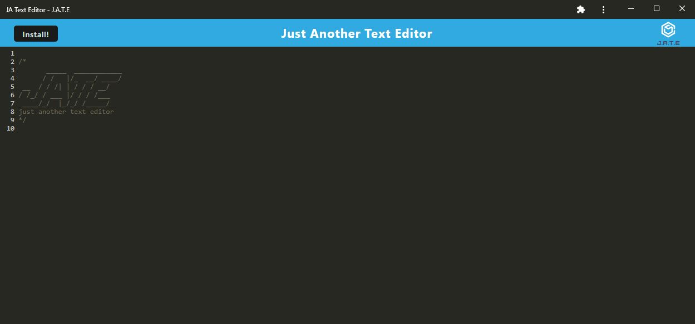

# 19 Progressive Web Applications (PWA) - Just Another Text Editor

## Description
A text editor that runs in the browser. This is a single-page application that meets the PWA criteria. Additionally, it features a number of data persistence techniques that serve as redundancy in case one of the options is not supported by the browser. The application will also function offline.

## Table of Contents
- [Installation](#installation)
- [Usage](#usage)
- [Credits](#credits)
- [License](#license)

## Installation

N/A

## Usage 
Application deployed at the following link: [Deployed J.A.T.E Application](https://park-d-text-editor.herokuapp.com/)

When the user opens the page on Heroku, they can type in the text editor, and when they press the install button, it is installed onto their system, and can work offline. When the user types in the text editor the content will save on refresh.

## Credits
While working on this project, I worked alongside Jackson Myhre and Roy Logan in the same bootcamp class. A lot of this assignment was taken from class activities and edited to work in this assignment. 

## License
Licensed by The Unlicense
